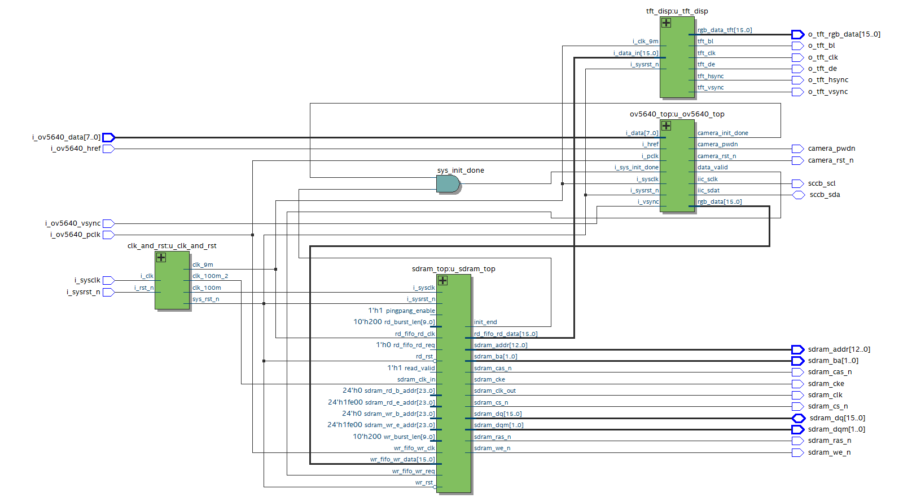

# ov5640_tft_480x272

Using ov5640 collects image, and using tft display the data collected by ov5640

Block diagram of modules:

device type: Cyclone IV E: EP4CE10F17C8

tft resolution ratio: 480x272

camera type: OV5640
